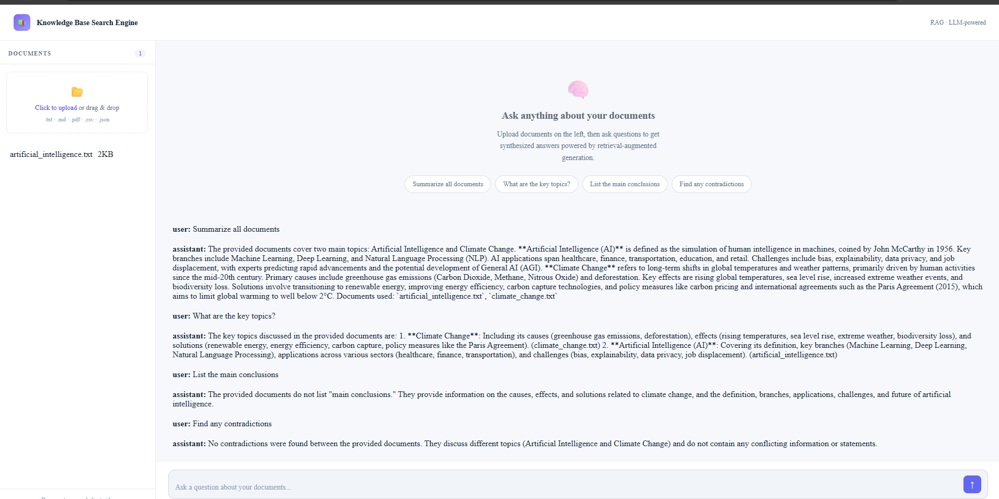

# Knowledge Base Search Engine

A **Retrieval-Augmented Generation (RAG)** powered knowledge base search engine that lets you upload documents and ask natural language questions — getting synthesized, cited answers using **Google Gemini**.

---

## 📸 Demo

> Upload `.txt`, `.md`, `.pdf`, `.csv`, or `.json` files → Ask questions → Get LLM-synthesized answers with source attribution.

---
### 🧠 Example Output

- Summarizes multiple documents
- Identifies key topics
- Extracts conclusions
- Detects contradictions

---
## 🏗️ Architecture

```
User Query
    │
    ▼
┌─────────────────┐
│   Frontend UI   │  ← Drag & drop upload, chat interface
│  (index.html)   │
└────────┬────────┘
         │ HTTP / Direct API
         ▼
┌─────────────────┐
│  Backend API    │  ← FastAPI (Python) 
│  (server.py)    │
└────────┬────────┘
         │
         ▼
┌─────────────────────────────────────────┐
│        RAG Pipeline                     |
│                                         |
│ 1. RETRIEVAL: Rank documents            |
│    using keyword matching               |
│                                         |
│ 2. AUGMENTATION: Inject context         |
│         into prompt                     |
│                                         |
│ 3. GENERATION: Gemini generates         |
│      answer from context                │  
└────────┬────────────────────────────────┘
         │
         ▼
┌─────────────────┐
│  Gemini API     │  ← gemini-2.5-flash
└─────────────────┘
```

---

## 🚀 Quick Start

#### Prerequisites
- Python 3.9+
- Gemini API Key from Google AI Studio

---

### ⚙️ Setup

```bash
# Clone repo
git clone https://github.com/yourusername/knowledge-base-search-engine
cd knowledge-base-search-engine

# Install dependencies
cd backend
pip install -r requirements.txt

# Set Gemini API key
export GEMINI_API_KEY="your-key-here"

# Run server
python server.py
👉 Server runs at:
http://localhost:8000

🖥️ Run Frontend
Open:
frontend/index.html
```
## 📁 Project Structure
```
knowledge-base-search-engine/
├── frontend/
│   └── index.html          # Complete UI — drag & drop upload, chat interface
├── backend/
│   ├── server.py           # FastAPI backend with RAG pipeline
│   └── requirements.txt    # Python dependencies
├── sample-docs/
│   ├── artificial_intelligence.txt
│   └── climate_change.txt
└── README.md
```
```
## 🔌 API Endpoints

| Method | Endpoint | Description |
|--------|----------|-------------|
| `POST` | `/ingest` | Upload a document |
| `POST` | `/query` | Ask a question (RAG query) |
| `GET` | `/health` | Health check |
| `GET` | `/test-gemini` | Test Gemini connection |
| `GET` | `/list-models` | List available models |

### Example: Query via cURL

```bash
# Upload a document
curl -X POST http://localhost:8000/ingest \
  -F "file=@sample-docs/artificial_intelligence.txt"

# Ask a question
curl -X POST http://localhost:8000/query \
  -H "Content-Type: application/json" \
  -d '{"query": "What are the main applications of AI?"}'
```

### Example Response

```json
{
  "answer": "The provided documents discuss Artificial Intelligence and Climate Change. AI applications include healthcare, finance, transportation, education, and retail.",
  "sources": ["artificial_intelligence.txt", "climate_change.txt"],
  "model": "models/gemini-2.5-flash"
}
```

---

## ⚙️ RAG Pipeline Details

### Retrieval
The current implementation uses **keyword frequency scoring** to rank documents by relevance to the query. For production use, upgrade to:
- **Embeddings**: Use Gemini embeddings or other embedding models to embed document chunks
- **Vector Store**: Store embeddings in [Chroma](https://www.trychroma.com/), [Pinecone](https://www.pinecone.io/), or [Weaviate](https://weaviate.io/)
- **Semantic Search**: Retrieve top-k chunks using similarity search (e.g., cosine similarity)

### Augmentation
Top-k retrieved document chunks are injected into the Gemini prompt as context before generating the answer.

### Generation (LLM Prompt)
```
"You are a precise knowledge-base search assistant using RAG.
Answer the user's question using ONLY the provided document context.
Be concise but thorough.
Mention which document(s) you used.
If the answer is not found, say so clearly."
```

---

## 🛠️ Supported File Types

| Extension | Notes |
|-----------|-------|
| `.txt` | Plain text — fully supported |
| `.md` | Markdown — fully supported |
| `.csv` | CSV data — read as text |
| `.json` | JSON data — read as text |
| `.pdf` | Requires `pypdf` for text extraction |

---

## 🔐 API Key Security

- **Frontend mode**: No API key is required in the UI (handled via backend)
- **Backend mode**: API key is loaded from the `GEMINI_API_KEY` environment variable — never exposed to the frontend

---

## 📈 Upgrade Path

| Feature | Current | Production Upgrade |
|---------|---------|-------------------|
| Retrieval | Keyword scoring | Embeddings + vector DB |
| Storage | In-memory | PostgreSQL / S3 |
| Chunking | Full document | Sliding window chunking |
| PDF parsing | Basic | `pymupdf` / `pdfplumber` |
| Auth | None | JWT / OAuth |

---

## 🙏 Built With

- **Google Gemini API** — LLM for answer generation  
- [FastAPI](https://fastapi.tiangolo.com/) — Backend API framework  
- Vanilla HTML/CSS/JavaScript — Zero-dependency frontend  
## 📸 Demo

### 🖥️ Application Output



> Upload documents → Ask questions → Get intelligent answers using Gemini-powered RAG.
##Thank you
